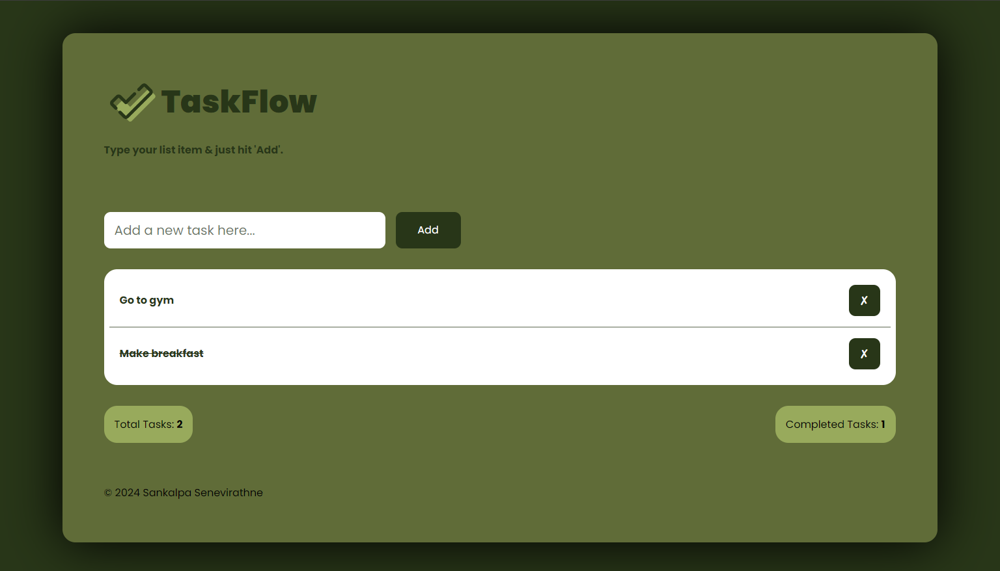

## Overview
TaskFlow is a minimalist to-do list application built with React. Designed with a focus on simplicity and ease of use, TaskFlow allows you to efficiently manage your tasks and stay organized.

## Features
- **Add Tasks**: Quickly add new tasks with a simple input field.
- **Mark as Done**: Easily mark tasks as completed.
- **Delete Tasks**: Remove tasks that are no longer needed.
- **Responsive Design**: Enjoy a seamless experience on both desktop and mobile devices.

## Screenshot
